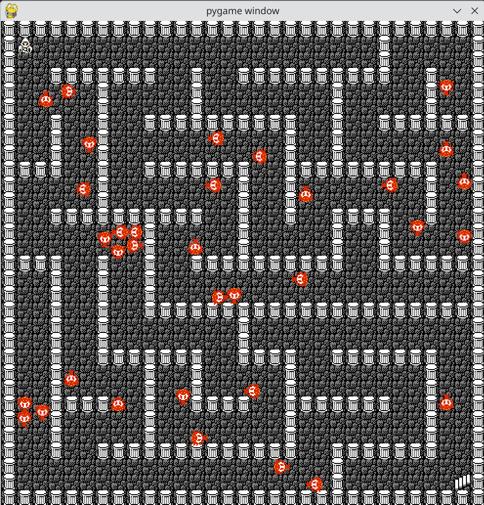

# Lost In A Dungeon

A rougelike written in pygame.

## Usage

Clone the repo, then run `$PYTHON3 main.py`, where `$PYTHON3` refers
to your Python 3 executable.

Currently, Python 3.13+ is supported.

## Background

You are lost in a maze, and need to find the way out.

Each time you enter the maze, it seems different each time.

Nevertheless, you are armed with a sword to fight anything that gets
in your way.

## Controls

Use w,a,s,d to move the player.

Use k to draw your sword, to kill the red crawlers.

## Rules and Objective

Avoid the crawlers. If you touch one, you lose the game.

Reach the stairs at the far corner of the maze, and you win.
